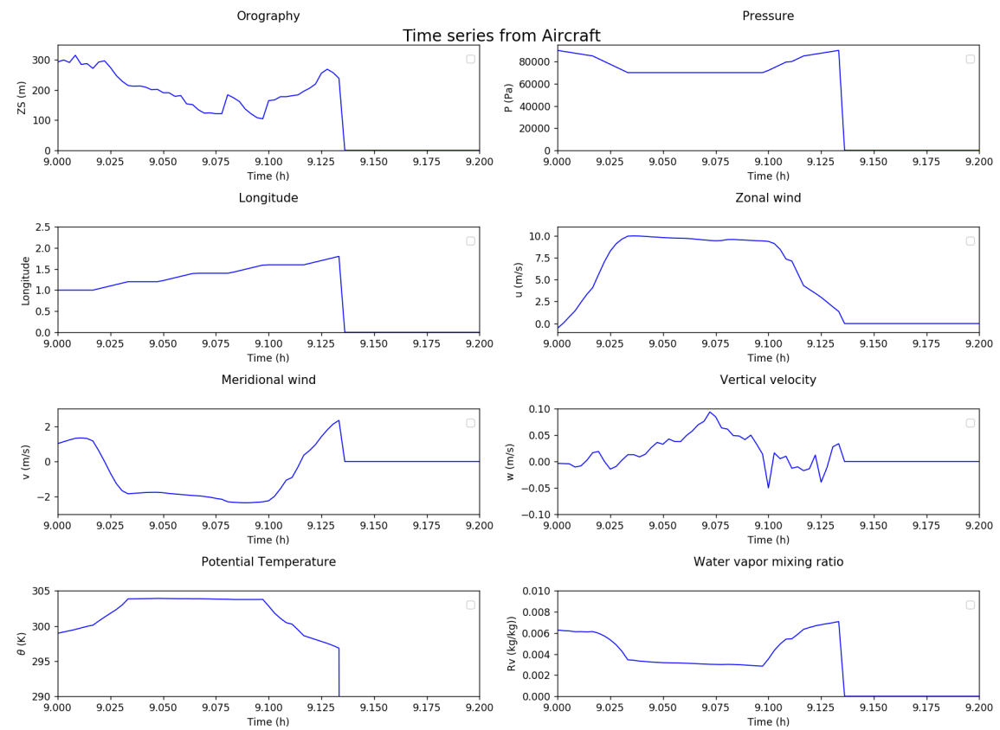

## Plot 2



````python
Panel = PanelPlot(8,2, [14,20],'Time series from Aircraft', titlepad=25, minmaxpad=1.04, timepad=-0.07, colorbarpad=0.03, labelcolorbarpad = 13, colorbaraspect=18)

Lplot = [ Dvar['f13'][(LG_AVIONT,'ZS')]]
Ltime = [Dvar['f13'][(LG_AVION,'time_flyer')]/3600.0]
Ltitle = ['Orography']
Lxlab = ['Time (h)']
Lylab = ['ZS (m)']
Lylim = [(0, 350)]
Lxlim = [(9.0, 9.2)]
fig = Panel.pXY_lines(Lyy=Lplot, Lxx=Ltime, Lxlab=Lxlab, Lylab=Lylab, Ltitle=Ltitle, Lylim=Lylim, Lxlim=Lxlim)

Lplot = [ Dvar['f13'][(LG_AVIONT,'P')]]
Ltitle = ['Pressure']
Lylab = ['P (Pa)']
Lylim = [(0, 95000)]
fig = Panel.pXY_lines(Lyy=Lplot, Lxx=Ltime, Lxlab=Lxlab, Lylab=Lylab, Ltitle=Ltitle, Lylim=Lylim, Lxlim=Lxlim, ax=fig.axes) 

Lplot = [ Dvar['f13'][(LG_AVIONT,'LON')]]
Ltitle = ['Longitude']
Lylab = ['Longitude']
Lylim = [(0, 2.5)]
fig = Panel.pXY_lines(Lyy=Lplot, Lxx=Ltime, Lxlab=Lxlab, Lylab=Lylab, Ltitle=Ltitle, Lylim=Lylim, Lxlim=Lxlim, ax=fig.axes)

Lplot = [ Dvar['f13'][(LG_AVIONT,'ZON_WIND')]]
Ltitle = ['Zonal wind']
Lylab = ['u (m/s)']
Lylim = [(-1, 11)]
fig = Panel.pXY_lines(Lyy=Lplot, Lxx=Ltime, Lxlab=Lxlab, Lylab=Lylab, Ltitle=Ltitle, Lylim=Lylim, Lxlim=Lxlim, ax=fig.axes)

Lplot = [ Dvar['f13'][(LG_AVIONT,'MER_WIND')]]
Ltitle = ['Meridional wind']
Lylab = ['v (m/s)']
Lylim = [(-3, 3)]
fig = Panel.pXY_lines(Lyy=Lplot, Lxx=Ltime, Lxlab=Lxlab, Lylab=Lylab, Ltitle=Ltitle, Lylim=Lylim, Lxlim=Lxlim, ax=fig.axes)

Lplot = [ Dvar['f13'][(LG_AVIONT,'W')]]
Ltitle = ['Vertical velocity']
Lylab = ['w (m/s)']
Lylim = [(-0.1, 0.1)]
fig = Panel.pXY_lines(Lyy=Lplot, Lxx=Ltime, Lxlab=Lxlab, Lylab=Lylab, Ltitle=Ltitle, Lylim=Lylim, Lxlim=Lxlim, ax=fig.axes)

Lplot = [ Dvar['f13'][(LG_AVIONT,'Th')]]
Ltitle = ['Potential Temperature']
Lylab = [r'$\theta$ (K)']
Lylim = [(290, 305)]
fig = Panel.pXY_lines(Lyy=Lplot, Lxx=Ltime, Lxlab=Lxlab, Lylab=Lylab, Ltitle=Ltitle, Lylim=Lylim, Lxlim=Lxlim, ax=fig.axes)

Lplot = [ Dvar['f13'][(LG_AVIONT,'Rv')]]
Ltitle = ['Water vapor mixing ratio']
Lylab = ['Rv (kg/kg))']
Lylim = [(0, 0.01)]
fig = Panel.pXY_lines(Lyy=Lplot, Lxx=Ltime, Lxlab=Lxlab, Lylab=Lylab, Ltitle=Ltitle, Lylim=Lylim, Lxlim=Lxlim, ax=fig.axes)

fig.tight_layout()
Panel.save_graph(1,fig)
````
