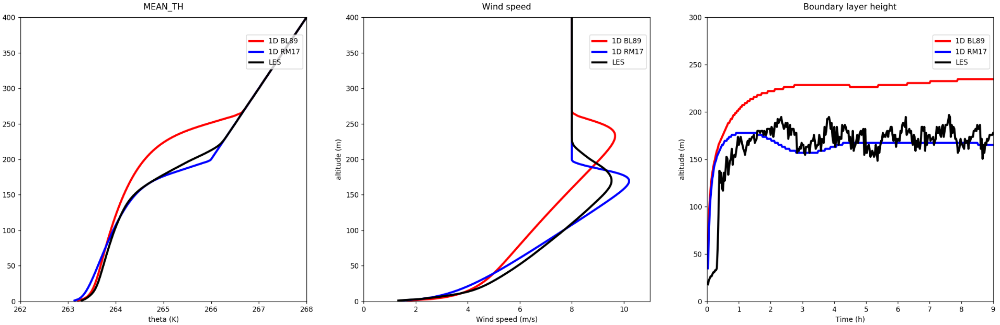
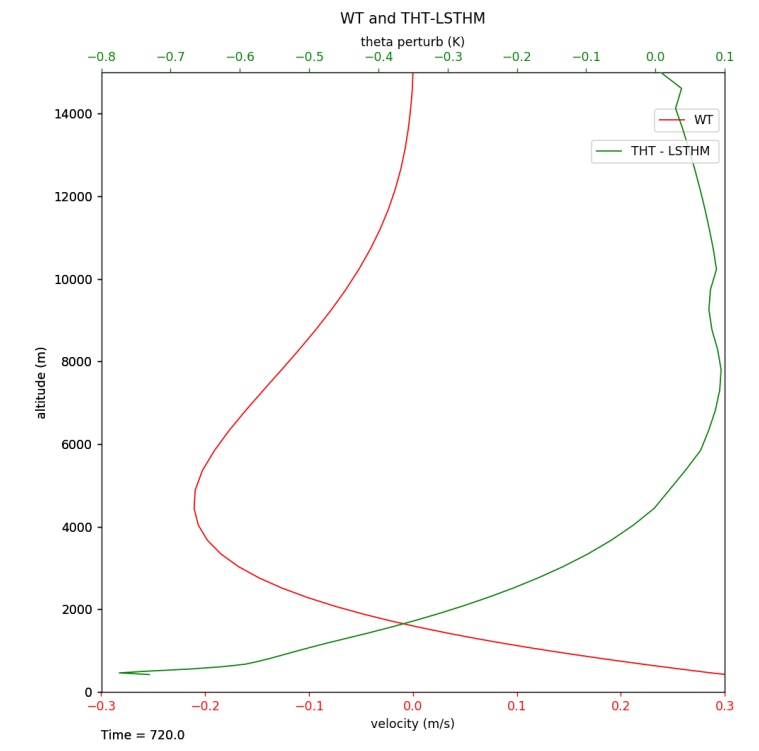
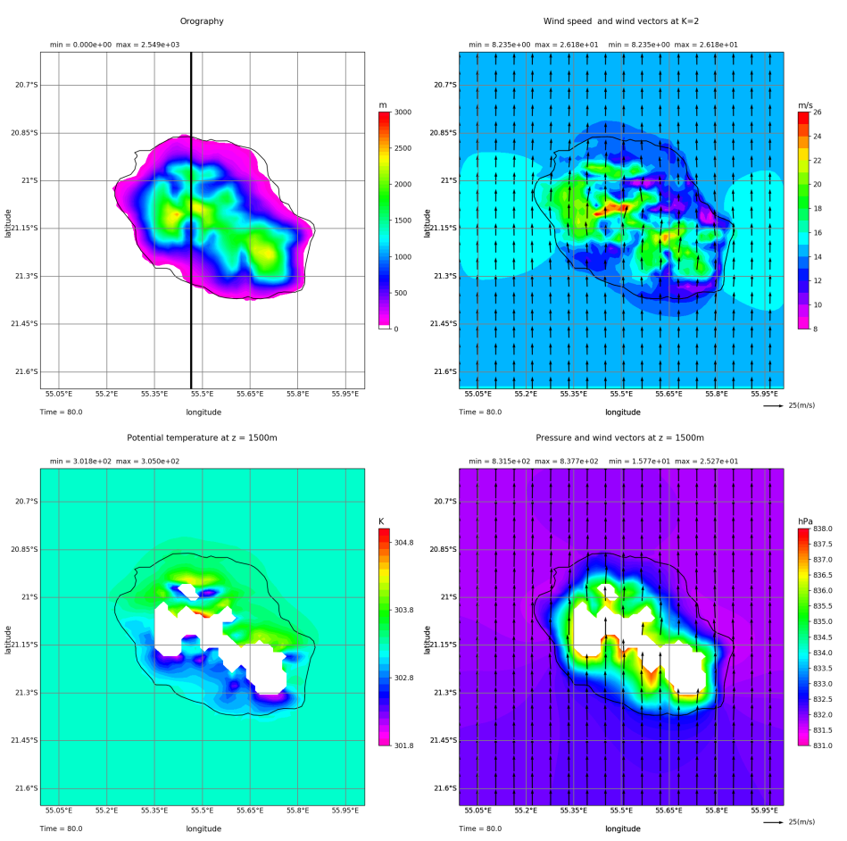
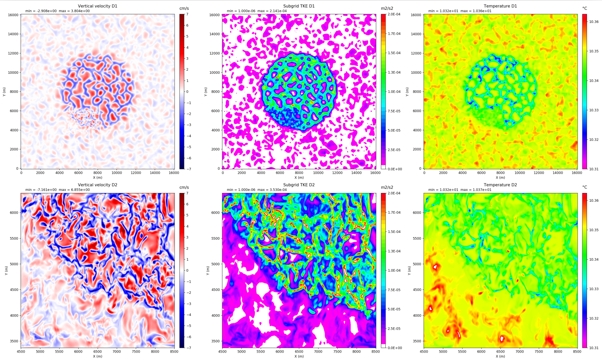
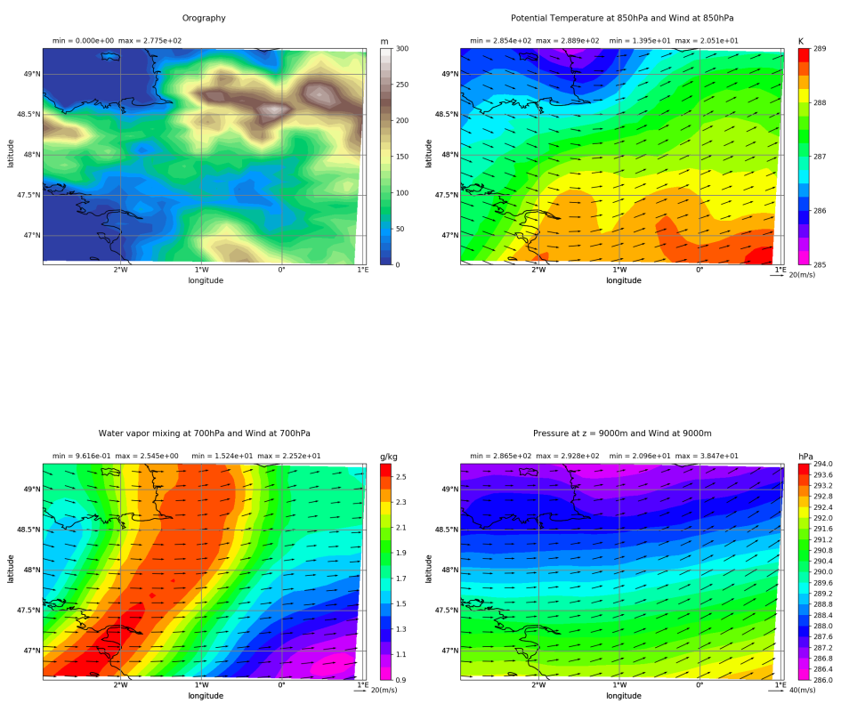
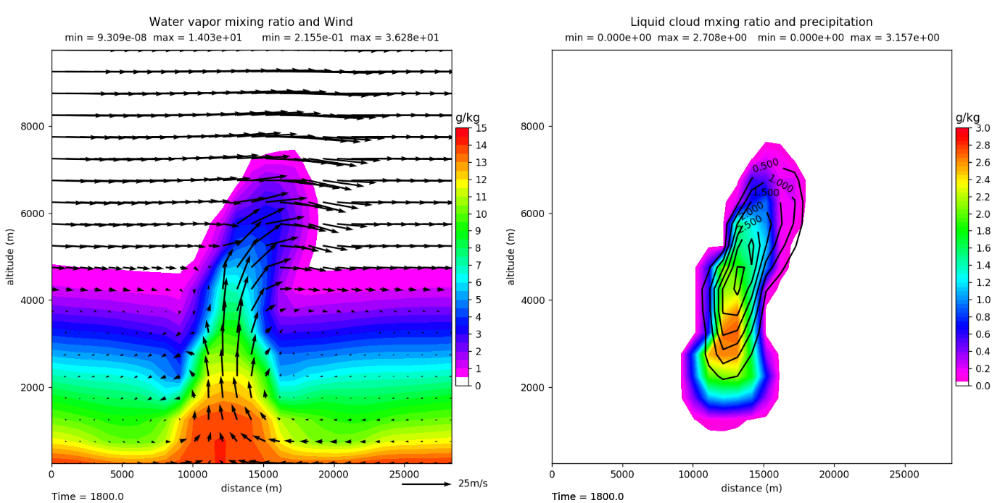
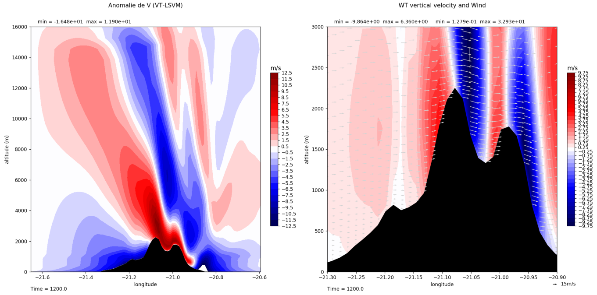
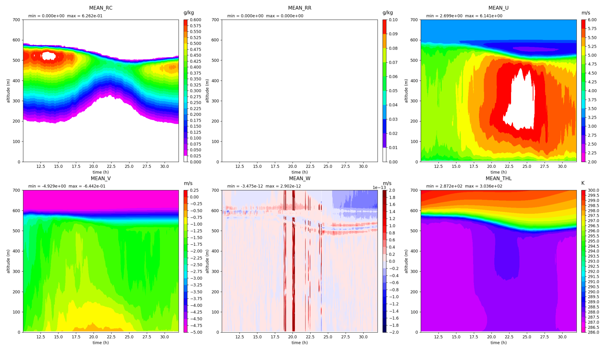
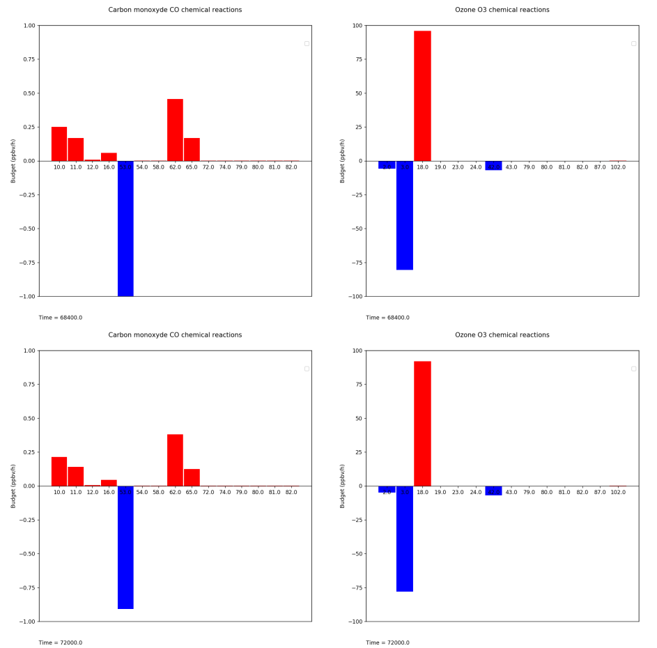

# MNHPy

---

## Read Meso-NH outputs

| Single file | Multiple file |
| ----   | ----   |
| [View source](gallery/view/single_file.md) |[View source](gallery/view/multiple_file.md) |

| Diachronic file | Full doc |
| ----   | ----   |
| [View source](gallery/view/diachronic_file.md) |[View source](gallery/view/full_doc.md) |

---

## XY lines

| Plot 1 | Plot 2 |
| ----   | ----   |
|  | |
| [View source](gallery/view/XY_multisimple_GABLS1.md) |[View source](gallery/view/XY_lines_tseries_aircraft_AZF2M.md) |

---

| Plot 3 | Plot 4 |
| ----   | ----   |
|  | |
| [View source](gallery/view/XY_budget_terms.md) |[View source](gallery/view/XY_lines_001_2Drelief.md) |

---

## Horizontal cross section

| Plot 1 | Plot 2 |
| ----   | ----   |
|  | |
| [View source](gallery/view/sectionH_004_Reunion.md) |[View source](gallery/view/sectionH_2dom_front_AZF_full.md) |

---

| Plot 3 | Plot 4 |
| ----   | ----   |
| | |
|[View source](gallery/view/sectionH_OCEAN.md) |[View source](gallery/view/sectionH_vectors_007janvier_full.md) |

---

## Vertical cross section

| Plot 1 | Plot 2 |
| ----   | ----   |
|  | |
| [View source](gallery/view/sectionV_KW78_full.md) | [View source](gallery/view/sectionV_Reunion_full.md) |

---

## 3D

| Mayavi |
| ----   |
|  |
| [View source](gallery/view/3D_mayavi.md) |

---

## Hovmoller plot

| Plot 1 |
| ----   |
|  |
| [View source](gallery/view/timeseries_FIRE_full.md) |

---

## Histogram

| 009 test case |
| ---- |
|  |
| [View source](gallery/view/histogramm_009ICARTT_full.md) |

